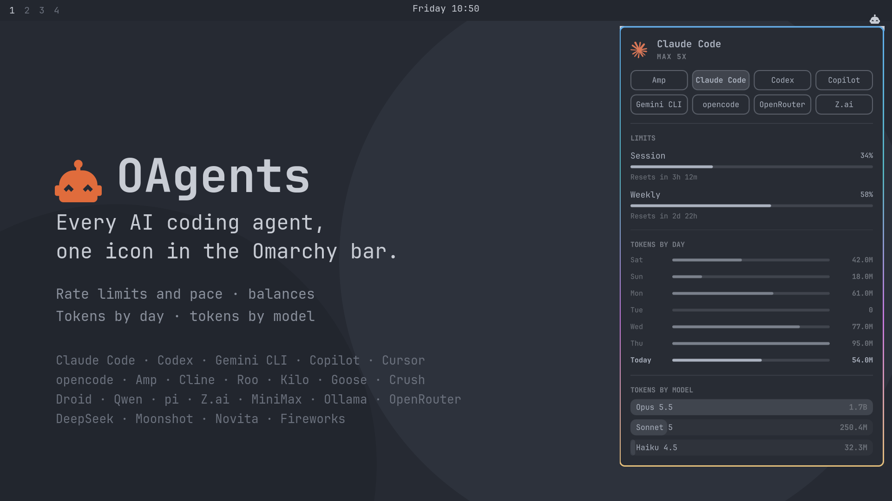

# OAgents: Every AI Coding Agent in the Omarchy Bar

<p align="center">
  
</p>

<p align="center">
  <b>Rate limits, balances and token usage for 23 AI coding agents and providers, in one Omarchy bar panel.</b>
</p>

<p align="center"><sub>Shown with <a href="#-preview-mode-for-reviews-and-demos">preview mode</a> sample data.</sub></p>

OAgents is Omarchy's built-in **Agents** panel ([`omarchy.agents`][upstream]),
extended from three agents to 23. The panel is the same: rate-limit meters
with pace, prepaid balances, tokens by day for the last week, and tokens by
model. OAgents adds 20 more data sources that read your agents' local
session files or the providers' usage APIs.

[upstream]: https://github.com/omacom/omarchy/tree/947e2fc002d6831c7888b29b5761d59d29e69727/shell/plugins/agents

---

## ✨ Features

- **One icon, every agent**: one tab per agent. An agent appears only after
  it has recorded usage or you've given it credentials, so there's nothing to
  configure for agents you don't use. With no agents at all, the icon stays
  out of the bar.
- **Rate limits with pace**: session, weekly and monthly windows for Claude
  Code, Codex, Copilot, Cursor, Z.ai, MiniMax and Ollama Cloud, each with the
  time until it resets.
- **Balances**: prepaid credit for OpenRouter, DeepSeek, Moonshot, Novita and
  Fireworks.
- **Token history**: tokens per day for the last week, and all-time tokens per
  model with the input / output / cache split on hover.
- **Everything else from upstream**: keyboard navigation, IPC, per-agent
  enable switches, and merged usage across machines through a synced folder.

---

## 🤖 Supported Agents

### Local usage (read from files on disk)

| id | Agent | Reads |
|---|---|---|
| `claude` | Claude Code | Omarchy's collector: transcripts + OAuth limits |
| `codex` | Codex | Omarchy's collector: sessions + app-server limits |
| `gemini` | Gemini CLI | `~/.gemini/tmp/*/chats/*` |
| `qwen` | Qwen Code | `~/.qwen/{tmp,projects}/*/chats/*` |
| `opencode` | opencode (every provider) | `~/.local/share/opencode/opencode.db` + legacy `storage/message` |
| `pi` | pi / oh-my-pi (every provider) | `~/.pi/agent/sessions`, `~/.omp/agent/sessions` |
| `amp` | Amp | `~/.local/share/amp/threads/*.json` |
| `droid` | Factory Droid | `~/.factory/sessions/**/*.settings.json` (session totals) |
| `goose` | Goose | `~/.local/share/goose/sessions/sessions.db` + legacy `.jsonl` |
| `crush` | Crush | every project's `crush.db` in `~/.local/share/crush/projects.json` |
| `cline` | Cline | VS Code-family `globalStorage/saoudrizwan.claude-dev/tasks`, `~/.cline/data/tasks` |
| `roo` | Roo Code | `globalStorage/rooveterinaryinc.roo-cline/tasks` |
| `kilocode` | Kilo Code | `globalStorage/kilocode.kilo-code/tasks` |

The Cline-family collectors check Code, Code - OSS, Code - Insiders, VSCodium,
Cursor, Windsurf, Kiro, Trae and Positron.

### Limits and balances (read from the provider's API)

| id | Agent | Shows | Credential |
|---|---|---|---|
| `copilot` | GitHub Copilot | Monthly premium / chat / completion quotas | `gh auth login` |
| `cursor` | Cursor | Monthly included / Auto / API pools | Cursor IDE sign-in, or `cursor-agent login` |
| `zai` | Z.ai GLM Coding Plan | 5-hour, weekly and monthly MCP windows | `ZAI_API_KEY` |
| `minimax` | MiniMax Token Plan | Rolling and weekly windows | `MINIMAX_API_KEY` |
| `ollama` | Ollama Cloud | Session / weekly / monthly usage | `OLLAMA_API_KEY` |
| `openrouter` | OpenRouter | Credit balance + key spend limit | `OPENROUTER_API_KEY` |
| `deepseek` | DeepSeek | Prepaid balance | `DEEPSEEK_API_KEY` |
| `moonshot` | Moonshot / Kimi API | Prepaid balance | `MOONSHOT_API_KEY` |
| `novita` | Novita AI | Prepaid balance | `NOVITA_API_KEY` |
| `fireworks` | Fireworks | Omarchy's collector: estimated balance + billing usage | see the Omarchy docs |

---

## 🚀 Quick Start

### 1. Requirements
- Omarchy Linux (v4.0+ Quattro)
- `python3` and `jq` (installed by default)
- Optional: `github-cli` for the Copilot tab (`sudo pacman -S github-cli && gh auth login`)

### 2. Installation

#### Via Omarchy Plugin Manager (Recommended)
Add and enable directly from git into your Omarchy shell:

```bash
omarchy plugin add https://github.com/TiniTinyTerminator/OAgents.git --enable
```

#### Via Git Checkout
Clone the repository and run the installer:

```bash
git clone https://github.com/TiniTinyTerminator/OAgents.git ~/Projects/OAgents
cd ~/Projects/OAgents
./install.sh
```

Installer options:

```bash
./install.sh --link        # symlink the checkout instead of copying (for development)
./install.sh --no-enable   # install without adding the icon to the bar
./install.sh --uninstall   # remove the plugin and its usage data
```

If Omarchy's own Agents widget is also in your bar, hide it with
`omarchy plugin disable omarchy.agents`. Otherwise you get two icons with
overlapping data.

---

## 🔑 Adding API Keys

The file-based agents need no setup. Each API collector looks for a key in
three places, in this order:

1. **Environment variable** (see the table above). The shell runs collectors
   with *its* environment, so a variable exported only in your terminal won't
   be seen.
2. **`~/.config/ttt/agents.json`**:

   ```json
   {
     "openrouter": { "apiKey": "sk-or-…" },
     "zai":        { "apiKey": "…" },
     "moonshot":   { "apiKey": "…", "region": "cn" }
   }
   ```

   `"region": "cn"` switches `moonshot`, `zai` (open.bigmodel.cn) and
   `minimax` (minimaxi.com) to their China endpoints.
3. **opencode**: the key opencode stored in
   `~/.local/share/opencode/auth.json`, if you signed in to that provider
   there.

Keep `agents.json` private: `chmod 600 ~/.config/ttt/agents.json`.

---

## 🖥️ Widget Panel Shortcuts

| Input | Action |
|---|---|
| Left click on the icon | Open or close the panel |
| Right click on the icon | Launch an agent (`omarchy-agent --pick`) |
| Middle click on the icon | Next agent |
| `h` / `l` | Previous / next agent |
| `j` / `k` | Scroll |
| `r` or Enter | Refresh |
| Tab | Move to the neighboring bar panel |
| Esc | Close |

IPC:

```bash
omarchy-shell ttt.agents <open|close|toggle|refresh|next>
```

---

## 👀 Preview Mode (for reviews and demos)

Preview mode runs the panel on sample data for eight agents. Nothing on disk
or on the network is read, and your real usage records are not touched.

Turn it on with the **Preview mode** setting, or:

```bash
omarchy bar set ttt.agents previewMode true --json
```

The sample records are written to `$XDG_RUNTIME_DIR/ttt-agents-preview/`,
with dates relative to today. Sync is off while preview mode is on, so sample
data never reaches a synced folder.

---

## ⚙️ Configuration

Settings live in the widget's entry in `~/.config/omarchy/shell.json`. Set them
with `omarchy bar set ttt.agents <key> <value>`. Numbers and booleans need
`--json`, or they're stored as strings.

| Key | Default | What it does |
|---|---|---|
| `refreshIntervalSec` | `900` | How often the usage records regenerate |
| `providers` | all enabled | `{"<id>": {"enabled": false}}` hides an agent and skips its collector |
| `syncMode` | `"Off"` | `"On"` writes this machine's snapshot and merges the others |
| `syncDir` | `""` | A folder synced by Syncthing, Dropbox, rsync, … |
| `syncFileName` | `<hostname>.json` | This machine's snapshot file |
| `syncDeviceId` | hostname | Stable device name inside the snapshot |
| `previewMode` | `false` | Show sample data instead of real usage |

```bash
omarchy bar set ttt.agents refreshIntervalSec 300 --json
omarchy bar set ttt.agents providers '{"cursor": {"enabled": false}}' --json
```

### How it works

- `bin/ttt-agent-usage-update` runs every `omarchy-agent-usage-*` collector
  that ships with Omarchy, plus every executable in `collectors/`, in
  parallel. It writes one JSON record per agent to
  `~/.local/state/ttt/agents/usage/`. If a plugin collector has the same name
  as an Omarchy one, the plugin's collector runs instead.
- Records use the same JSON contract as Omarchy's collectors, so `Main.qml`
  and `Agent.qml` are nearly unchanged from upstream.
- Local scans are cached in `~/.cache/ttt/agent-usage` so that opening the
  panel doesn't rescan every session file.

### Adding an agent

Drop an executable `collectors/<id>` that prints one record (see
`collectors/gemini` for a short example built on `collectors/_agentusage.py`).
An `assets/<id>.svg` mark is optional; the bar glyph is used when it's
missing.

### Caveats

- Tabs for tools (opencode, pi) can overlap with tabs for subscriptions
  (Claude Code, Codex). For example, an opencode session on Anthropic counts
  in both the `opencode` tab and the `claude` tab.
- Droid and Crush store session totals, not per-turn usage. A whole session
  counts toward the last day it was active.
- API collectors follow each provider's current response format, and a
  provider can change it. A collector that can't parse a response shows a
  status line in its tab instead of failing.

---

## 🧪 Tests

```bash
python3 tests/test_collectors.py      # local scanners against fixture sessions
python3 tests/test_api_collectors.py  # API collectors against canned responses
```

---

## 📂 Project Structure

```
OAgents/
├── manifest.json            # Omarchy plugin manifest (bar-widget)
├── install.sh               # Native installer script (copy, link, uninstall)
├── README.md                # Documentation & usage guide
├── LICENSE                  # MIT License
├── preview.png              # Marketplace / README preview
├── Panel.qml                # Bar icon and popout panel
├── Main.qml                 # Record discovery, refresh timer, cross-device sync
├── Agent.qml                # Per-record file watcher
├── bin/
│   └── ttt-agent-usage-update   # Runs every collector, writes the usage records
├── collectors/
│   ├── _agentusage.py       # Shared accumulator, cache, credentials, HTTP
│   ├── _gemini_chats.py     # Gemini CLI / Qwen Code chat parser
│   ├── _cline_tasks.py      # Cline / Roo / Kilo task parser
│   ├── _preview.py          # Preview mode sample records
│   └── <agent>              # One executable collector per agent
├── assets/                  # Agent marks (assets/<id>.svg)
└── tests/
    ├── test_collectors.py
    └── test_api_collectors.py
```

---

## 📜 License

MIT License — Copyright (c) 2026 TiniTinyTerminator. Based on the Omarchy
Agents panel, MIT License — Copyright (c) David Heinemeier Hansson.
